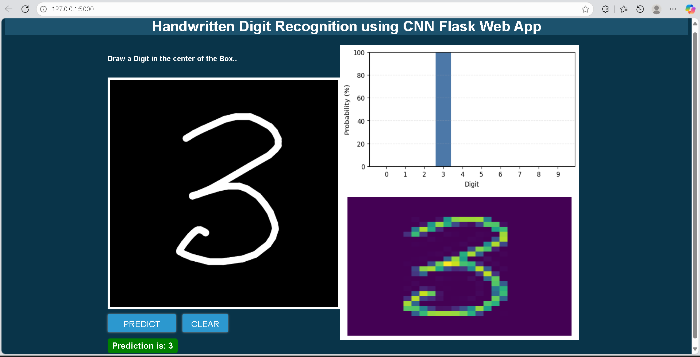

# 🧠 Handwritten Digit Recognition AI ✍️

**A full-stack web application that uses a PyTorch-powered Convolutional Neural Network (CNN) to recognize digits drawn on an interactive canvas in real-time.**

<p>
  
  
  
  
</p>

</div>

---

## 🚀 Live Demo & Preview

This application is deployed and live! You can try it out yourself by visiting the link below.

**[➡️ Click here to access the live application][(https://drive.google.com/file/d/1rUPBKLFUFZQlvRdiLE08QozG8VQHqpck/view?usp=sharing)]**

<br>

---

## ✨ Core Features

* **🎨 Interactive Drawing Canvas:** Draw any digit from 0 to 9 on a responsive HTML5 canvas.
* **⚡ Instant AI Prediction:** Get immediate feedback from the backend CNN model.
* **📊 Probability Analysis:** See a bar chart visualizing the model's confidence for each possible digit.
* **🔍 Input Visualization:** View the exact 28x28 grayscale image that the AI sees for better interpretability.
* **✅ Smart UI Validation:** The interface prompts you to draw if the canvas is blank, ensuring a smooth user experience.

---

## 🛠️ Technology Stack

This project integrates a complete machine learning pipeline with a modern web framework.

| Area              | Technologies Used                               |
| ----------------- | ----------------------------------------------- |
| **Backend** | Python, Flask, Gunicorn                         |
| **Machine Learning** | PyTorch, NumPy, Pandas, Scikit-learn          |
| **Frontend** | HTML, CSS, JavaScript, jQuery (for AJAX)        |
| **Data Viz** | Matplotlib (for generating plots on the server) |

---

## 🚀 How to Run Locally

Want to run the project on your own machine? Follow these simple steps.

### 1. **Clone the Repository**
```bash
git clone https://github.com/hemalatha0303/Hand_Written_digit_Recognition_flask_app.git
cd your-repository-name
```

### 2. **Set Up a Virtual Environment**
```bash
# Create and activate a virtual environment
python -m venv venv
source venv/bin/activate  # On Windows, use `.\venv\Scripts\activate`
```

### 3. **Install Dependencies**
```bash
pip install -r requirements.txt
```

### 4. **Train the AI Model**
This script will train the CNN on the MNIST dataset and save the `mnist.pt` file.
```bash
python train.py
```

### 5. **Launch the Web App**
```bash
python app.py
```
> 🎉 Your application is now running at **http://127.0.0.1:5000**!

---

## 🤖 Project Workflow

<div align="center">
  
</div>

1.  **User Input:** A digit is drawn on the web interface.
2.  **AJAX Request:** The canvas image is sent to the Flask backend as a base64 string.
3.  **Image Preprocessing:** The server decodes the image, crops it, resizes it to 28x28, and normalizes it to match the MNIST training format.
4.  **Model Inference:** The processed tensor is fed into the pre-trained PyTorch CNN model.
5.  **Generate Visuals:** The model's output probabilities are used to create plots with Matplotlib.
6.  **JSON Response:** The final prediction and plots are sent back to the frontend.
7.  **Display Results:** JavaScript updates the UI to display the prediction and new images.
